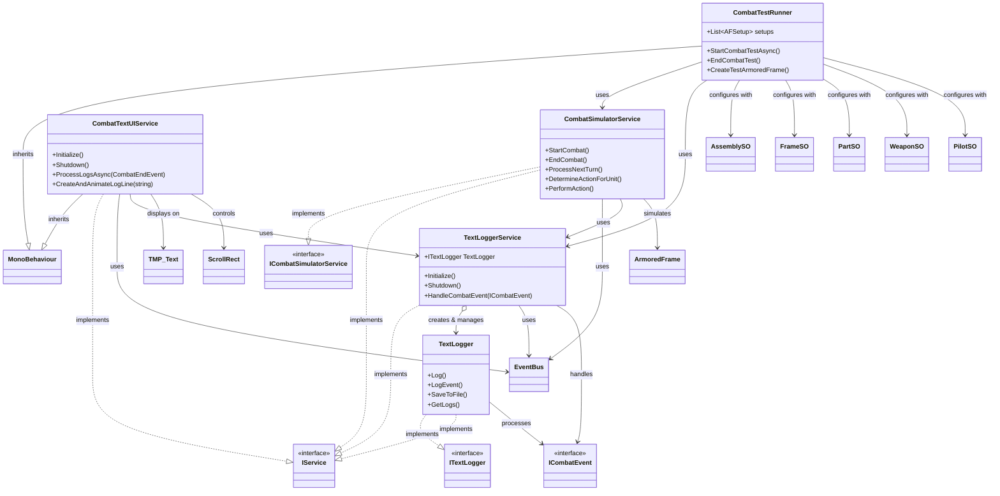

# 전투 시스템 및 로그 관련 클래스 분석

이 문서는 AF 프로젝트의 전투 시뮬레이션, 테스트, 로그 기록 및 UI 표시 관련 핵심 클래스들을 분석하고 관계를 설명합니다.

## 클래스 개요

*   **CombatSimulatorService**: 전투의 핵심 로직을 담당하며, 턴 관리, 행동 결정 및 수행 등을 처리합니다.
*   **CombatTestRunner**: Unity 에디터에서 다양한 설정으로 전투 시뮬레이션을 실행하고 테스트하기 위한 도구입니다.
*   **TextLogger**: 전투 중 발생하는 모든 이벤트를 텍스트 로그로 기록하고 관리합니다.
*   **TextLoggerService**: 이벤트 버스를 통해 전투 이벤트를 수신하고 TextLogger에 로그 기록을 요청하는 중재자 서비스입니다.
*   **CombatTextUIService**: 전투 종료 후, 기록된 로그를 UI에 애니메이션과 함께 표시합니다.

## 클래스 다이어그램 (Mermaid)

## 클래스별 상세 분석

### CombatSimulatorService.cs

*   **역할**: 전투 시뮬레이션의 핵심 로직 관리.
*   **주요 기능**: 전투 시작/종료, 턴 관리, 유닛 행동 결정(AI 포함), 액션 수행, 팀 관리, 상태 이상 처리.
*   **상호작용**: `EventBus`로 이벤트 발행, `TextLoggerService`로 로그 기록 요청, `ArmoredFrame` 데이터 사용.
*   **구현**: `ICombatSimulatorService`, `IService`.

### CombatTestRunner.cs

*   **역할**: Unity 에디터 기반 전투 테스트 실행 도구.
*   **주요 기능**: 인스펙터 통한 참가 AF 설정(AssemblySO 또는 커스텀), 팀/위치 지정, 파츠/파일럿 미리보기, 비동기 전투 시작/종료 제어, 로그 옵션 설정.
*   **상호작용**: `CombatSimulatorService`로 전투 실행 요청, `TextLoggerService`로 로그 옵션 제어, 각종 `ScriptableObject`(AssemblySO, PartSO 등) 데이터 로드 및 사용.
*   **구현**: `MonoBehaviour` 상속, `OdinInspector` 활용.

### TextLogger.cs

*   **역할**: 텍스트 기반 전투 로그 기록 및 관리.
*   **주요 기능**: 이벤트 기반 로그 생성(`LogEvent`), 일반 메시지 로깅(`Log`), 로그 검색/필터링, 파일 저장, 로그 포맷팅(리치 텍스트 포함).
*   **상호작용**: `TextLoggerService`로부터 로그 기록 요청 받음, `ICombatEvent` 데이터 처리.
*   **구현**: `ITextLogger`, `IService`.

### TextLoggerService.cs

*   **역할**: 전투 이벤트 수신 및 로그 기록 요청 중재.
*   **주요 기능**: `EventBus` 구독 통한 이벤트 수신, 이벤트 핸들러 실행, `TextLogger` 인스턴스 관리, `TextLogger`에 로그 기록 요청, 로그 포맷팅 옵션 제어 인터페이스 제공.
*   **상호작용**: `EventBus`로부터 이벤트 수신, `TextLogger` 생성/관리 및 로그 기록 요청, `ICombatEvent` 처리.
*   **구현**: `IService`.

### CombatTextUIService.cs

*   **역할**: 전투 로그 UI 표시.
*   **주요 기능**: 전투 종료 시 `TextLoggerService`로부터 로그 가져오기, 로그 라인 프리팹 생성, 타이핑 애니메이션(`DOTween`)으로 로그 표시, 자동 스크롤.
*   **상호작용**: `EventBus`로 전투 종료 이벤트 수신, `TextLoggerService`로부터 로그 데이터 요청, UI 컴포넌트(`TMP_Text`, `ScrollRect`) 제어.
*   **구현**: `MonoBehaviour`, `IService`, `UniTask` 및 `DOTween` 활용. 