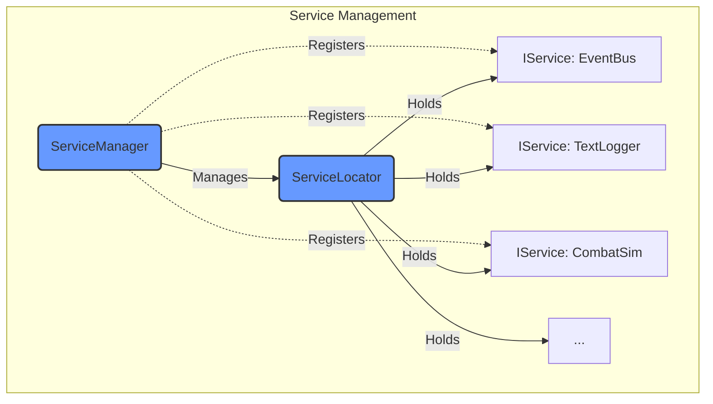
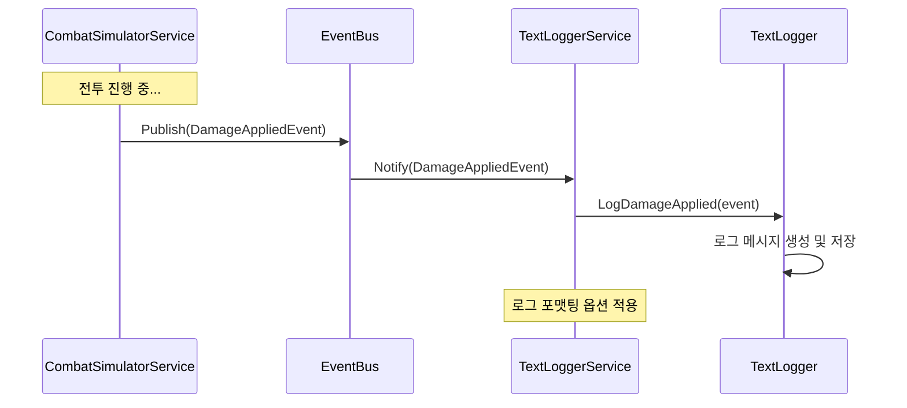
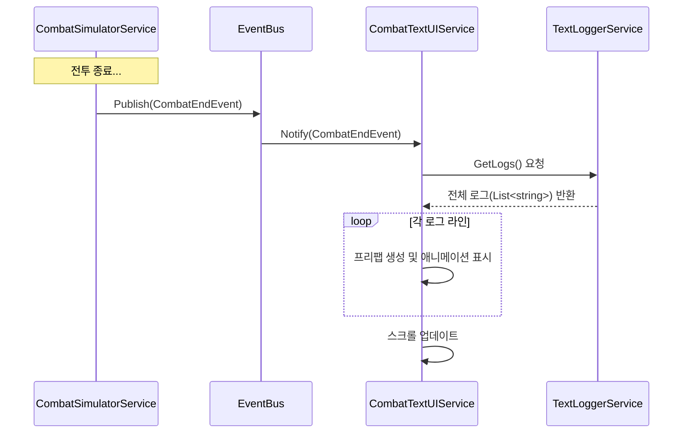

# AF 프로젝트 아키텍처 (텍스트 기반 RPG Ver.)

이 문서는 현재 AF 프로젝트의 핵심 아키텍처 구성 요소와 그 상호작용을 설명합니다. 텍스트 기반 RPG 방향성에 맞춰 실제 코드에서 확인된 컴포넌트 중심으로 기술합니다.

## 핵심 아키텍처 패턴

### 1. 서비스 로케이터 (Service Locator) 및 관리

*   **`ServiceLocator`:** 싱글톤 클래스로, 게임 내 각종 서비스(`IService` 구현체)에 대한 중앙 접근점 제공. 서비스 등록, 조회, 제거 기능 담당.
*   **`IService`:** 모든 서비스가 구현해야 하는 기본 인터페이스. `Initialize()`와 `Shutdown()` 메서드를 정의하여 서비스 생명주기 관리.
*   **`ServiceManager`:** MonoBehaviour 기반 서비스 관리자. 게임 시작 시 `Awake()`에서 `ServiceLocator`를 통해 핵심 서비스들(`EventBusService`, `TextLoggerService`, `CombatSimulatorService` 등)을 **자동으로 등록 및 초기화**. 인스펙터에서 추가 서비스 등록 및 종료 순서 관리 기능 제공. 게임 오브젝트 파괴 시 등록된 서비스들을 `Shutdown()`하고 제거.



### 2. 이벤트 버스 (Event Bus)

*   **`EventBus`:** 타입 기반의 발행-구독(Pub/Sub) 패턴 구현. 시스템 간의 직접적인 의존성을 줄이고 느슨한 결합 유지.
*   **`IEvent`:** 이벤트 버스를 통해 전달되는 모든 이벤트의 기본 마커 인터페이스.
*   **`EventBusService`:** `EventBus` 인스턴스를 `IService`로 감싸 `ServiceManager`에 의해 자동으로 등록됨.

```mermaid
graph LR
    Publisher -->|1. Publish(IEvent)| EventBus
    EventBus -->|2. Notify| Subscriber1[Listener 1 (Action<T>)]
    EventBus -->|2. Notify| SubscriberN[... Listener N]

    subgraph "Event Flow"
        direction LR
        Publisher
        EventBus
        Subscriber1
        SubscriberN
    end

    style EventBus fill:#f96,stroke:#333,stroke-width:2px
```

## 핵심 데이터 모델

게임의 주요 객체를 표현하는 클래스들입니다.

*   **`ArmoredFrame`:** 게임 내 전투 유닛(메카닉)을 나타내는 핵심 클래스. `Frame`, `Parts`, `Pilot`, `Weapons` 등 다양한 구성 요소를 조합하여 완성됨. 최종 스탯 계산, 데미지 적용, AP 관리, 상태 효과 처리 등 유닛의 모든 상태와 행동 로직 관리.
*   **`Frame` (abstract):** AF의 기본 골격. 타입(`FrameType`), 기본 스탯(`Stats`), 무게 정의. 파츠 슬롯 구성(`GetPartSlots()`)과 파츠 장착 규칙(`CanEquipPart()`) 정의.
    *   *구현체:* `LightFrame`, `StandardFrame`, `HeavyFrame` (각각 고유 슬롯 구성 정의)
*   **`Part` (abstract):** AF를 구성하는 부품 (머리, 몸통, 팔, 다리 등). 타입(`PartType`), 스탯(`Stats`), 무게, 내구도, 특수 능력 정의. 데미지 적용(`ApplyDamage`), 수리(`Repair`), 파괴 시 효과(`OnDestroyed()`) 정의.
    *   *구현체:* `HeadPart`, `BodyPart`, `ArmsPart`, `LegsPart` (각각 `OnDestroyed` 구현)
*   **`Weapon`:** AF에 장착되는 무기. 타입(`WeaponType`), 데미지, 사거리, 정확도, 공속, AP 소모량, 과열 등 정의. 발사(`Fire`), 냉각(`Cooldown`) 로직 포함.
*   **`Pilot`:** AF를 조종하는 파일럿. 이름, 기본 스탯(`Stats`), 레벨, 경험치, 전문화(`SpecializationType`), 스킬 등 정의. 성장(`GainExperience`, `LevelUp`) 로직 포함.
*   **`Stats`:** 모든 스탯 값(공격력, 방어력, 속도, AP 등)을 포함하는 데이터 구조체. 스탯 합산 및 수정 기능 제공.

```mermaid
classDiagram
    class ArmoredFrame {
        +Frame frameBase
        +Pilot pilot
        +Dictionary~string, Part~ parts
        +List~Weapon~ equippedWeapons
        +Stats combinedStats
        +float currentAP
        +bool isOperational
        +AttachPart(Part part, string slot) bool
        +ApplyDamage(string slot, float amount) bool
        +RecalculateStats()
        +ConsumeAP(float amount) bool
    }
    class Frame {
        <<abstract>>
        +FrameType type
        +Stats baseStats
        +float weight
        +{abstract} GetPartSlots() IReadOnlyDictionary~string, PartSlotDefinition~
        +CanEquipPart(Part part, string slot) bool
    }
    class Part {
        <<abstract>>
        +PartType type
        +Stats stats
        +float weight
        +float currentDurability
        +float maxDurability
        +bool isOperational
        +ApplyDamage(float amount) bool
        +Repair(float amount)
        +{abstract} OnDestroyed(ArmoredFrame af)
    }
    class Weapon {
        +WeaponType type
        +float damage
        +float range
        +float accuracy
        +float baseAPCost
        +Fire() bool
        +Cooldown(float amount)
    }
    class Pilot {
        +Stats baseStats
        +int level
        +List~string~ skills
        +SpecializationType specialization
        +GainExperience(int amount) bool
    }
    class Stats {
        +float AttackPower
        +float Defense
        +float Speed
        +float MaxAP
        +...
    }
    class PartSlotDefinition {
        +string SlotIdentifier
        +PartType RequiredPartType
    }

    ArmoredFrame o-- "1" Frame
    ArmoredFrame o-- "1" Pilot
    ArmoredFrame o-- "0..*" Part
    ArmoredFrame o-- "0..*" Weapon
    Frame ..> PartSlotDefinition : defines
    Frame --|> Stats
    Part --|> Stats
    Weapon --|> Stats
    Pilot --|> Stats

    Frame <|-- LightFrame
    Frame <|-- StandardFrame
    Frame <|-- HeavyFrame
    Part <|-- HeadPart
    Part <|-- BodyPart
    Part <|-- ArmsPart
    Part <|-- LegsPart

    note for ArmoredFrame "Manages composition and overall state"
    note for Frame "Defines base structure and slots"
    note for Part "Component with stats and durability"
```

## 주요 시스템 및 서비스

### 1. 전투 시뮬레이션 (`CombatSimulatorService`)

*   `IService` 구현체 (자동 등록됨). 전투의 시작, 종료, 턴 진행, AI 행동 결정, 공격/방어 판정 등 핵심 전투 로직 담당.
*   핵심 데이터 모델인 **`ArmoredFrame` 인스턴스**들을 관리하며 전투 진행.
*   전투 중 발생하는 다양한 상황(턴 시작/종료, 데미지 발생, 파츠 파괴 등)에 대해 `EventBus`를 통해 **이벤트 발행**.
*   `TextLoggerService`를 직접 참조하여 일부 요약/디버그 로그를 남기기도 함.

### 2. 텍스트 로깅 (`TextLogger`, `TextLoggerService`)

*   **`TextLogger`:** 실제 로그 메시지를 저장(List<LogEntry>)하고 포맷팅하는 클래스.
*   **`TextLoggerService`:** `TextLogger` 인스턴스를 관리하는 `IService` 구현체 (자동 등록됨).
    *   `EventBus`를 **구독**하여 전투 관련 이벤트(`CombatStartEvent`, `DamageAppliedEvent` 등) 수신.
    *   수신한 이벤트를 바탕으로 `TextLogger`를 호출하여 상세 전투 로그를 순차적으로 기록.



### 3. 전투 텍스트 UI (`CombatTextUIService`)

*   MonoBehaviour 기반 `IService` 구현체. **전투 종료 후** 전투 로그를 UI에 표시하는 역할.
*   `Initialize()` 시 `EventBus`를 구독하여 `CombatEndEvent` 수신.
*   `CombatEndEvent` 수신 시, `TextLoggerService`에서 해당 전투의 **전체 로그(List<string>)**를 가져옴.
*   가져온 로그를 한 줄씩 **UI 프리팹(`_logLinePrefab`)**으로 생성하여 컨테이너(`_logContainer`)에 추가.
*   각 로그 라인 표시에 **텍스트 타이핑 애니메이션(DOTween)** 적용.
*   로그 표시 시 **자동 스크롤** 기능 (`ScrollRect` 사용).



### 4. 전투 테스트 (`CombatTestRunner`)

*   Unity 에디터 전용 MonoBehaviour 클래스. 개발 편의성 및 디버깅 지원 목적.
*   Odin Inspector 활용하여 테스트 시나리오 설정.
*   `CombatSimulatorService` 및 `TextLoggerService`와 상호작용하여 전투 테스트 수행 및 로그 확인.

---
*이 문서는 검토된 핵심 컴포넌트 위주로 작성되었으며, 다른 시스템과의 상세한 상호작용은 생략되었을 수 있습니다.* 